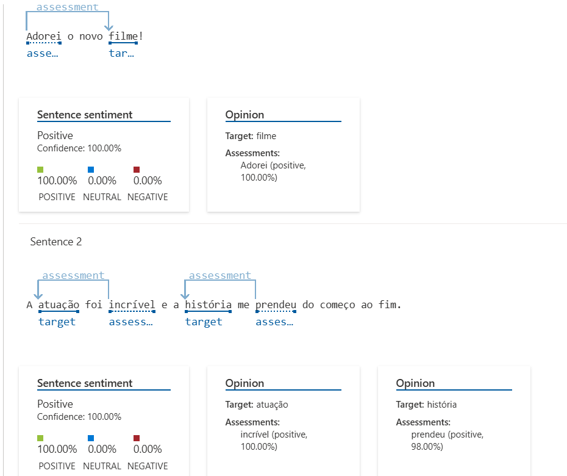

# Análise de Sentimentos com Language Studio no Azure AI
Estudo sobre análise de sentimentos com Language Studio no Azure AI

## Introdução
A análise de sentimentos é uma técnica de Processamento de Linguagem Natural que permite identificar a polaridade emocional de um texto, classificando-o como positivo, negativo ou neutro. O Azure AI Language Studio oferece uma solução baseada em IA para realizar essa análise.

## Processo
1. **Acesso ao Language Studio**: Acesse a plataforma Azure AI Language Studio e selecione a ferramenta de Análise de Sentimentos.
2. **Entrada de Texto**: Insira frases para que a IA possa analisar seus sentimentos.
3. **Processamento**: O modelo de IA avalia cada sentença e retorna uma pontuação indicando se o sentimento é positivo, negativo ou neutro.
4. **Interpretação dos Resultados**: A ferramenta exibe insights sobre cada frase, destacando palavras-chave que influenciaram a classificação.

## Exemplos de Sentenças e Resultados
As seguintes frases foram analisadas pelo Language Studio:

1. **"Adorei o novo filme! A atuação foi incrível e a história me prendeu do começo ao fim."**
   - **Resultado**: Positivo
   - **Insight**: Palavras como "Adorei", "incrível" e "prendeu" indicam entusiasmo e satisfação. 

   

2. **"O serviço do restaurante foi péssimo. Demoraram muito para nos atender e a comida estava fria."**
   - **Resultado**: Negativo
   - **Insight**: Termos como "péssimo" e "fria" demonstram insatisfação e frustração. 

   

3. **"A palestra foi interessante, mas achei um pouco longa e cansativa."**
   - **Resultado**: Neutro
   - **Insight**: O termo "interessante" sugere um aspecto positivo, mas "longa" e "cansativa" adicionam um tom negativo, tornando a análise mais equilibrada. 

   

  Resultado final: 

   

## Possibilidades e Aplicações
- **Monitoramento de Opinião Pública**: Empresas podem usar essa tecnologia para entender o que clientes estão falando sobre seus produtos ou serviços.
- **Análise de Feedbacks**: Auxilia na identificação de pontos fortes e áreas de melhoria com base em comentários de usuários.
- **Classificação Automática de Textos**: Pode ser integrado a chatbots e sistemas de suporte para direcionamento eficiente de solicitações.

## Conclusão
A análise de sentimentos no Azure AI Language Studio oferece uma maneira intuitiva e poderosa de interpretar emoções em textos. A partir dos resultados, podemos obter insights valiosos sobre opiniões e sentimentos, permitindo tomadas de decisão mais estratégicas.

